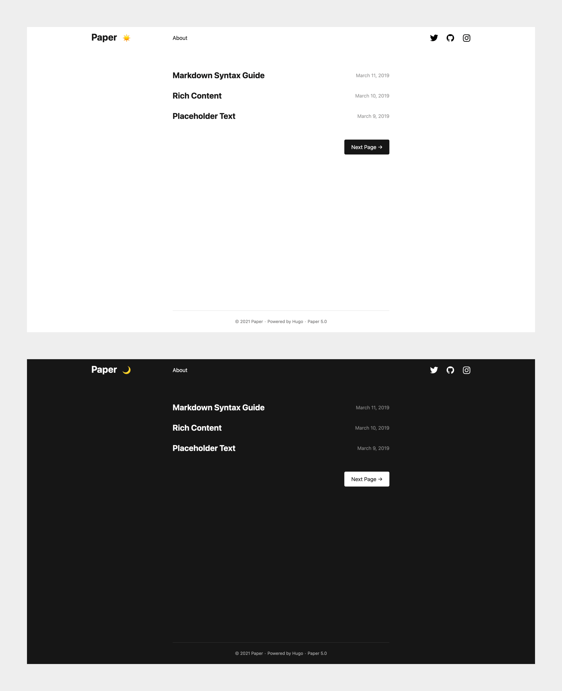
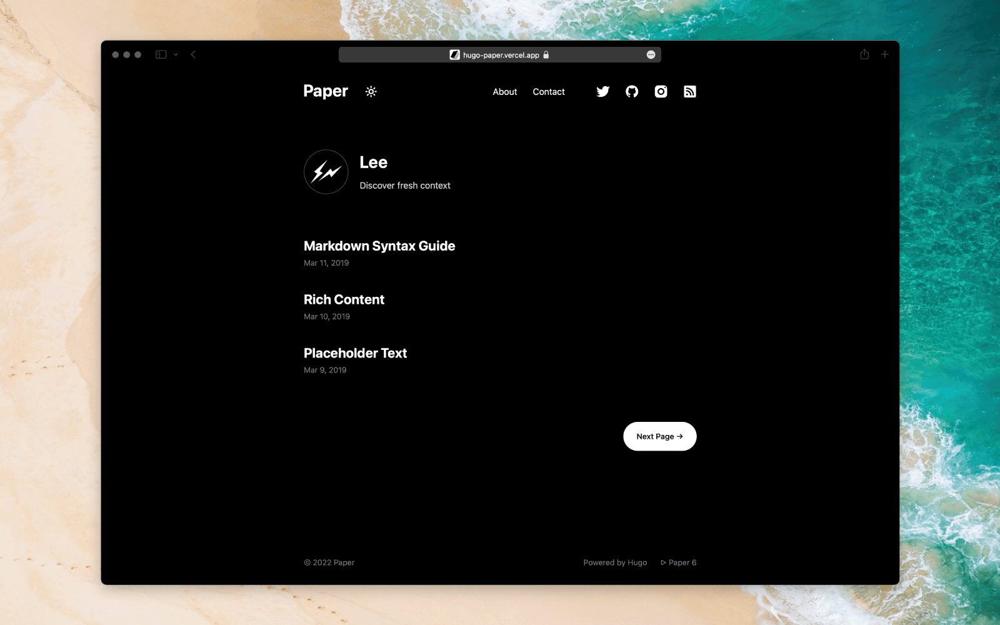
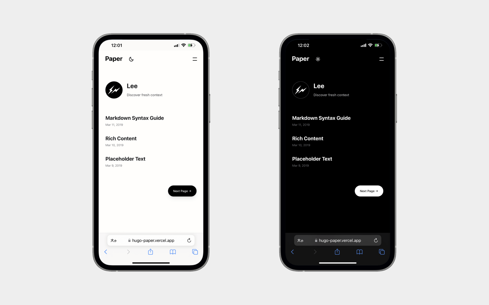
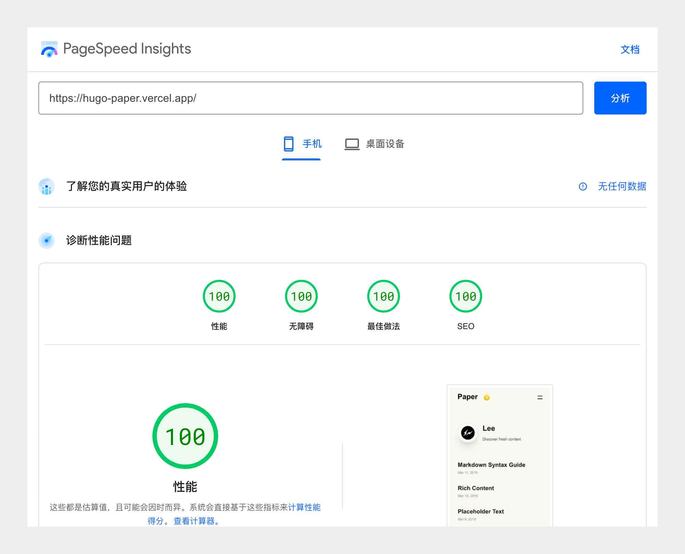

<div align="center">
<p><a href="https://kee.so/" target="_blank"></a></p>

Create now ➫ [🔗 kee.so](https://kee.so/)

</div>

---

<div align="center">
<h1>Paper <sup><sup><sub>6.24</sub></sup></sup></h1>

Demo → [hugo-paper.vercel.app](https://hugo-paper.vercel.app/)

A simple, clean, customizable Hugo theme.

⚡️ Fast | 👒 Customizable | 🫙 Smooth

</div>

## Links

Product Hunt: [producthunt.com/posts/hugo-paper-6](https://www.producthunt.com/posts/hugo-paper-6)

Hugo themes: [themes.gohugo.io/hugo-paper](https://themes.gohugo.io/hugo-paper/)

## Overview






## Options

Available options to `config.toml` or `hugo.toml`:

```toml
disqusShortname = 'YOUR_DISQUS_SHORTNAME'   # use disqus comments

[params]
  # color style
  color = 'linen'                           # linen, wheat, gray, light

  # header social icons
  twitter = 'YOUR_TWITTER_ID'               # twitter.com/YOUR_TWITTER_ID
  github = 'YOUR_GITHUB_ID'                 # github.com/YOUR_GITHUB_ID
  instagram = 'YOUR_INSTAGRAM_ID'           # instagram.com/YOUR_INSTAGRAM_ID
  linkedin = 'YOUR_LINKEDIN_ID'             # linkedin.com/in/YOUR_LINKEDIN_ID
  mastodon = 'YOUR_MASTODON_LINK'           # e.g. 'https://mastodon.instance/@xxx'
  rss = true                                # show rss icon

  # home page profile
  avatar = 'GRAVATAR_EMAIL'                 # gravatar email or image url
  name = 'YOUR_NAME'
  bio = 'YOUR_BIO'


  # misc
  disableHLJS = true                        # disable highlight.js
  disablePostNavigation = true              # disable post navigation
  monoDarkIcon = true                       # show monochrome dark mode icon
  gravatarCdn = 'GRAVATAR_CDN_LINK'         # e.g. 'https://cdn.v2ex.com/gravatar/'
  math = true                               # enable KaTeX math typesetting globally
  graphCommentId = "YOUR_GRAPH_COMMENT_ID"  # use graph comment (disqus alternative)

  # giscus
[params.giscus]
  repo = 'YOUR_GISCUS_REPO'                 # see https://giscus.app for more details
  repoId = 'YOUR_GISCUS_REPO_ID'
  category = 'YOUR__GISCUS_CATEGORY'
  categoryId = 'YOUR_GISCUS_CATEGORY_ID'
  mapping = 'pathname'
  theme = 'light'
  lang = 'zh-CN'
```

Available options to front matter:

```toml
comments = false                            # disable comments for a specific page
math = true                                 # enable KaTeX math typesetting for a specific page
```

## Install

### As git submodule

Inside the folder of your Hugo project, run:

```bash
git submodule add https://github.com/nanxiaobei/hugo-paper themes/paper
```

Open `config.toml`(or `hugo.toml`), change `theme` to `"paper"`:

```toml
theme = "paper"
```

For more information, please read the [official guide](https://gohugo.io/getting-started/quick-start/#configure-the-site) of Hugo.

### As hugo module

Add paper theme ad dependency of your site:

```bash
hugo mod init github.com/nanxiaobei/hugo-paper
```

Open `config.toml`(or `hugo.toml`), remove the `theme` line (if present), add `module` section to the bottom of the file:

```toml
[module]
  [[module.imports]]
    path = "github.com/nanxiaobei/hugo-paper"
```

For more information, please read the [official guide](https://gohugo.io/hugo-modules/use-modules/#use-a-module-for-a-theme) of Hugo.

## License

[MIT License](https://github.com/nanxiaobei/hugo-paper/blob/main/LICENSE) (c) [nanxiaobei](https://lee.so/)
